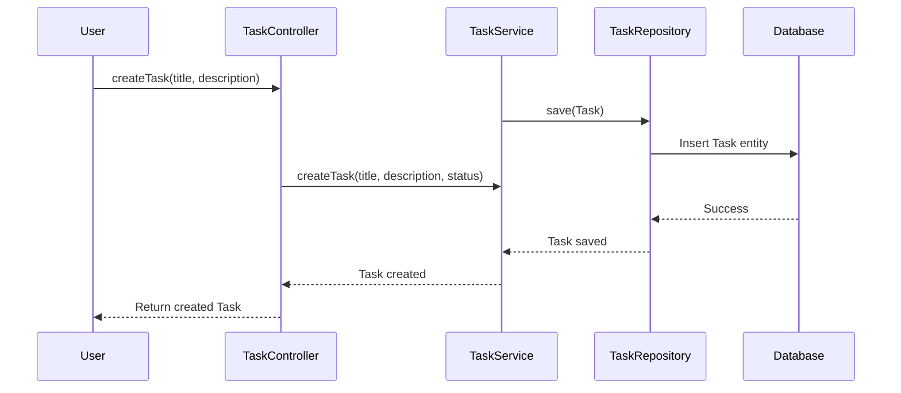

```mermaid
sequenceDiagram
    participant User
    participant TaskController
    participant TaskService
    participant TaskRepository
    participant Database

    User ->> TaskController: createTask(title, description)

    TaskService ->> TaskRepository: save(Task)
    TaskRepository ->> Database: Insert Task entity
    TaskController ->> TaskService: createTask(title, description, status)
    Database -->> TaskRepository: Success
    TaskRepository -->> TaskService: Task saved
    TaskService -->> TaskController: Task created
    TaskController -->> User: Return created Task
```
