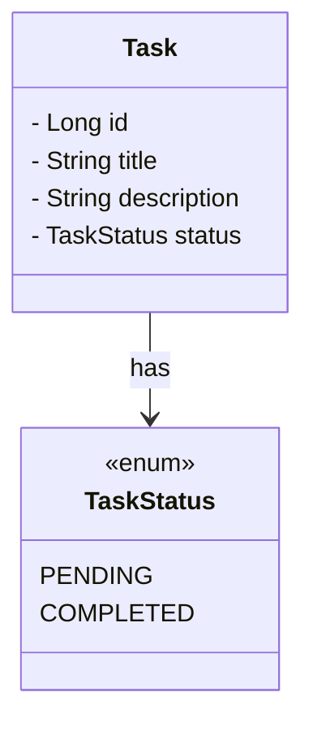

```mermaid

classDiagram
    class Task {
        - Long id
        - String title
        - String description
        - TaskStatus status
    }

    class TaskStatus {
        <<enum>>
        PENDING
        COMPLETED
    }

    Task --> TaskStatus : has

```
